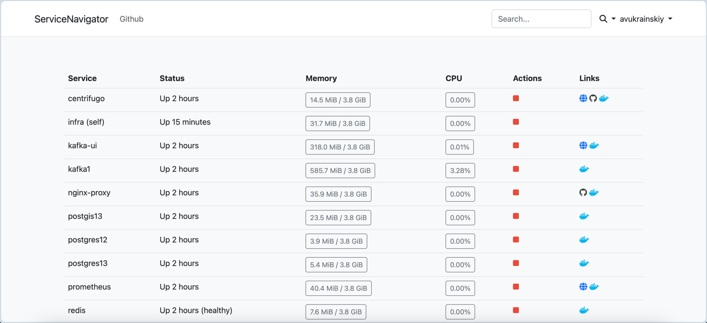

# Service Navigator


[](https://opensource.org/licenses/MIT)
[](https://hub.docker.com/r/artarts36/service-navigator)

Service Navigator - navigator for your local docker projects in single network



# Setup

1. Download config file: `curl https://raw.githubusercontent.com/ArtARTs36/service-navigator/master/service_navigator.yaml > service_navigator.yaml`
2. Define docker network name in `service_navigator.yaml` in section `backend.network_name`
3. Add next lines into your **docker-compose.yaml**:
```yaml
services:
  infra:
    image: artarts36/service-navigator:0.1.5
    ports:
      - "9101:8080"
    volumes:
      - type: bind
        source: "/var/run/docker.sock"
        target: "/var/run/docker.sock"
        read_only: true
      - ./:/app
    environment:
      USER: "${USER}"
    networks:
      - {YOUR_NETWORK_NAME}
```

## Config

Config is described in YAML file with name [service_navigator.yaml](./service_navigator.yaml)

```yaml
# This section contains settings for frontend
frontend:
  # Application Name
  #
  # Optional, default: "ServiceNavigator"
  app_name: ServiceNavigator

  # Navbar in header
  navbar:
    links:
      - url: http://github.com/artarts36/service-navigator
        title: Github
    profile:
      links:
        - url: http://github.com/artarts36/service-navigator
          title: Github
    search:
      providers:
        - name: google
        - name: stackoverflow
        - name: Jira
          url: https://jira.host.name/secure/QuickSearch.jspa
          queryParamName: searchString # search <form> input name

# This section contains settings for backend
backend:
  # Docker network name
  #
  # Required
  network_name: infra

  # Poll for finding information about services
  poll:
    # Interval for services polling
    #
    # Default: "2s"
    interval: "2s"

    metrics:
      # Count of stored records per service
      #
      # Optional, default: 50
      depth: 10

      # A flag that determines whether to store only unique metrics per service
      #
      # Optional, default: false
      only_unique: true
```

# How Service Navigator finding information about service

## Resolving service url

Service Navigator checks:
* `NGINX_PROXY` environment variable
* Public port as `http://localhost:{PORT}`

## Resolving repository url

Service Navigator looks at labels:
* `org.service_navigator.gitlab_repository`
* `org.service_navigator.github_repository`
* `org.service_navigator.bitbucket_repository`
* `org.opencontainers.image.source`
